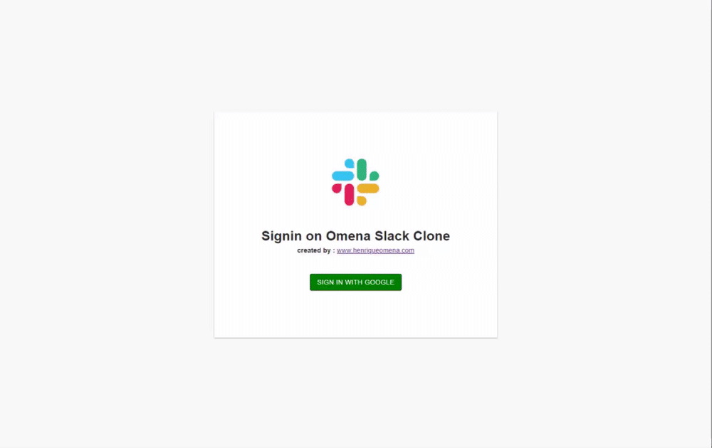
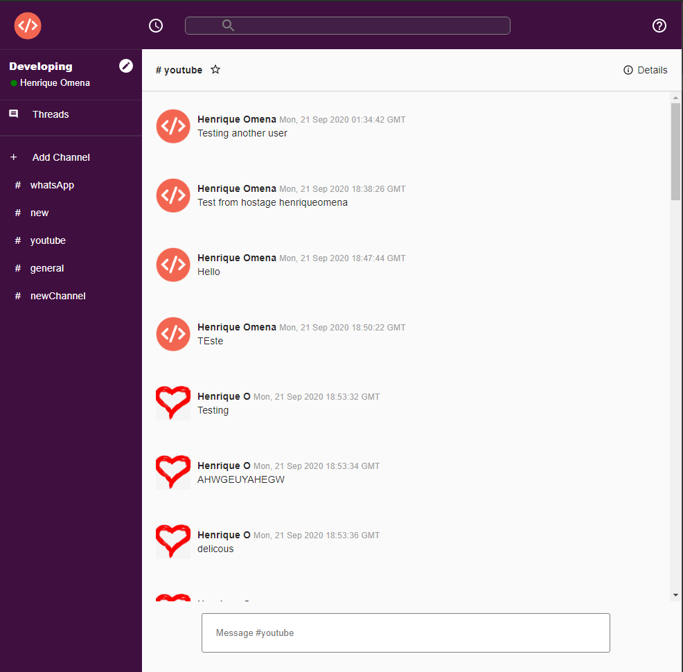

<h3 align="center">
  Clone Slack Authentication with Google
</h3>

<blockquote align="center">“Dreams don't work unless you do”!</blockquote>

    

## :trophy: About

The main idea here its be authenticate with google fire base and get real time conversation, you can create a channel and have conversation in any chat you want.

### :eyes: Live Preview:
Check out the [project](https://www.henriqueomena.com/slack-clone/)

### :art: Style code

Used to style code, ESLint, Prettier, EditorConfig, TypeScript

### :nerd_face: Chosen Technologies

1. TypeScript
2. Material Ui
3. Context Api
4. FireBase

### :dart: Result:

I do a chat where is possible log in with google authentication and receive messages in real time.

### :open_file_folder: More Images:

## :memo: License

This Project it a lincense MIT. See the file [LICENSE](LICENSE.md) for more details.

---
